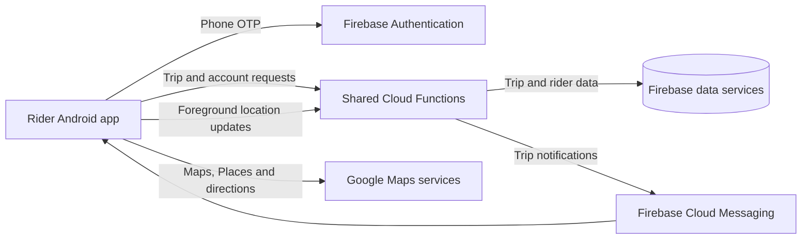

# Laundromat Delivery

The rider Android app for **Laundromat**, my 2021 BSc Software Engineering final-year project at the International Islamic University Islamabad. Riders use it to receive laundry pickup and return-delivery requests, navigate between customers and laundries, confirm handovers, and review trip earnings.

## What the rider app does

| Area | Client behavior |
| --- | --- |
| Registration and account | Collect rider contact, identity, driving-license, location, and JazzCash details, plus a photo, identity and license images. Register a vehicle with its plate, model, color, and four photos. Verify the phone number with Firebase OTP; log in, edit the rider profile, change or recover a password, and log out. |
| Availability | Switch online availability on or off. The dashboard shows the registered vehicle, trip counts, transaction counts, current trips, and earnings. |
| Trip requests | Receive pickup and delivery requests through Firebase Cloud Messaging. Review the route, distance, fare, payment method, order summary, and customer and merchant contacts before accepting or declining. Acceptance checks the rider's distance from the pickup point against the configured delivery radius. |
| Active trips | Start an accepted trip, confirm arrival at its source and destination, open directions in Google Maps, contact the customer or merchant, and cancel an eligible trip. |
| Handovers | Confirm collection with the order's pickup code and confirm delivery with its delivery code. The collection screen also checks the displayed cash amounts when applicable. |
| History and earnings | Browse requested, current, and past trips; view transaction history and total and daily earnings. |

## Trip workflow

1. Register a rider and vehicle, complete phone verification, and sign in. An administrator reviews rider registration.
2. Set availability and receive a `PICKUP` or `DELIVERY` request. Review its trip details and accept or decline it.
3. Start an accepted trip. The app records arrival at the source, collection, arrival at the destination, and completed delivery as separate steps.
4. At collection, enter the pickup code supplied by the customer or merchant. For cash payments, the screen checks the entered order and/or trip fare amounts for that trip type.
5. At the destination, enter the delivery code to complete the trip. Review completed trips and earnings in the dashboard and transaction screen.

The `TripStatus` model includes `REQUESTED`, `ACCEPTED`, `STARTED`, `ARRIVED_SOURCE`, `PICKED_UP`, `ARRIVED_DESTINATION`, `DELIVERED`, `COMPLETED`, `DECLINED`, and `CANCELLED`. The two `TripType` values are `PICKUP` (customer to laundry) and `DELIVERY` (laundry to customer).

## How it is built

- **Platform:** native Android with Java 8 language features, XML layouts, and Material Components.
- **Build:** Gradle 6.7.1 wrapper, Android Gradle Plugin 4.2.2, API 30 for compile/target, and API 23 (Android 6.0) as the minimum.
- **Backend:** Firebase Authentication for phone verification, callable Cloud Functions for rider and trip operations, and Firebase Cloud Messaging for trip requests and updates.
- **Maps and location:** Google Maps, Places, fused location services, and a foreground location service that sends rider coordinates to the backend while running. Directions can open in the Google Maps app.
- **Media and UI:** an image picker for registration photos, Picasso for images, and Lottie animations for status screens.

The client calls functions such as `delivery_boy-createNewDeliveryBoy`, `vehicle-verifyNewVehicleData`, `delivery_boy-setAvailability`, `delivery_boy-updateCurrentLocation`, `trip_task-acceptTripRequest`, `trip_task-startTrip`, `trip_task-confirmArrivalToSource`, `trip_task-confirmPickedUp`, and `trip_task-confirmDelivery`. These operations are part of the [shared Cloud Functions backend](https://github.com/taymoor-ghazanfar/laundromat-cloud-functions).



Activities and fragments implement account, trip, and handover screens. Models represent riders, vehicles, orders, trips, and transactions. The messaging service handles new trip events; the foreground service reports location through `delivery_boy-updateCurrentLocation`. The trip screens draw routes on an in-app map and can open directions in Google Maps.

### Repository layout

```text
app/
  build.gradle                  Android app configuration and dependencies
  src/main/AndroidManifest.xml  Activities, permissions, and services
  src/main/java/com/laundromat/delivery/
    activities/                Dashboard, trip, handover, account, and transaction screens
    fragments/                 Signup, profile, and trip-list pages
    model/                     Rider, vehicle, order, trip, and transaction models
    prefs/                     Local session preferences
    services/                  Firebase messaging, notifications, and location service
    ui/                        Adapters, view holders, and custom views
    utils/, helpers/           Validation, location, parsing, and route helpers
  src/main/res/                Layouts, strings, themes, icons, and animations
gradle/wrapper/                Gradle wrapper
```

## Build and run

### Prerequisites

- Android Studio with Android SDK and Build Tools for API 30, and a JDK compatible with the included Gradle configuration.
- An Android device or emulator running Android 6.0 (API 23) or later with Google Play services. The directions button expects the Google Maps app.
- A Firebase project with phone sign-in, Cloud Messaging, and the matching callable functions. Configure the Maps, Places, and Directions services used by the app.

1. Clone the repository and open its root directory in Android Studio.
2. Supply Firebase Android configuration for application ID `com.laundromat.delivery` in `app/google-services.json`.
3. Configure `google_maps_api_key` and `google_api_key` in `app/src/main/res/values/strings.xml` for Maps, routes, and Places.
4. Deploy the shared backend functions and configure the delivery radius used when accepting trips. Rider registration depends on the administrator approval workflow, and trip screens need customer and merchant records from the shared system.
5. Select the app run configuration in Android Studio, or run `./gradlew :app:assembleDebug` (`.\gradlew.bat :app:assembleDebug` on Windows). Install the debug APK on a device or emulator.

The manifest requests internet, camera, storage, foreground-service, and foreground/background location access. Grant location permission for the tracking and navigation screens to work.

## Related repositories

- [Customer app](https://github.com/taymoor-ghazanfar/laundromat-customer) — laundry discovery, booking, and order tracking.
- [Merchant app](https://github.com/taymoor-ghazanfar/laundromat-merchant) — catalog and order management.
- [Delivery app](https://github.com/taymoor-ghazanfar/laundromat-delivery) — trip requests, navigation, and handovers (this repository).
- [Admin app](https://github.com/taymoor-ghazanfar/laundromat-admin) — approvals and system administration.
- [Cloud Functions](https://github.com/taymoor-ghazanfar/laundromat-cloud-functions) — shared backend operations and notifications.

## Academic context and license

Developed by **Taymoor Ghazanfar**, supervised by **Dr. Muhammad Nadeem**, International Islamic University Islamabad (2021).

The repository includes an [Apache License 2.0](LICENSE) file.
